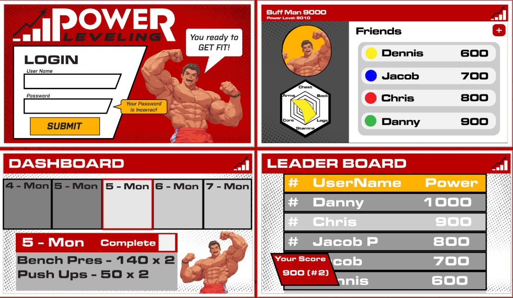
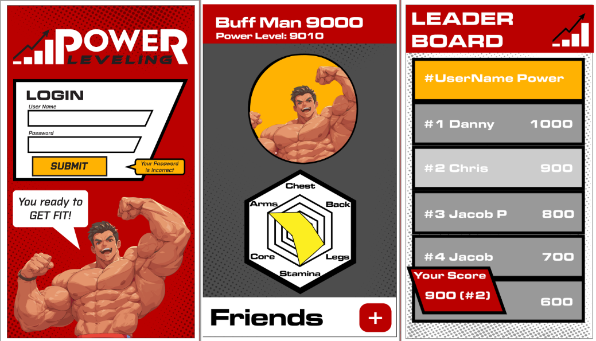
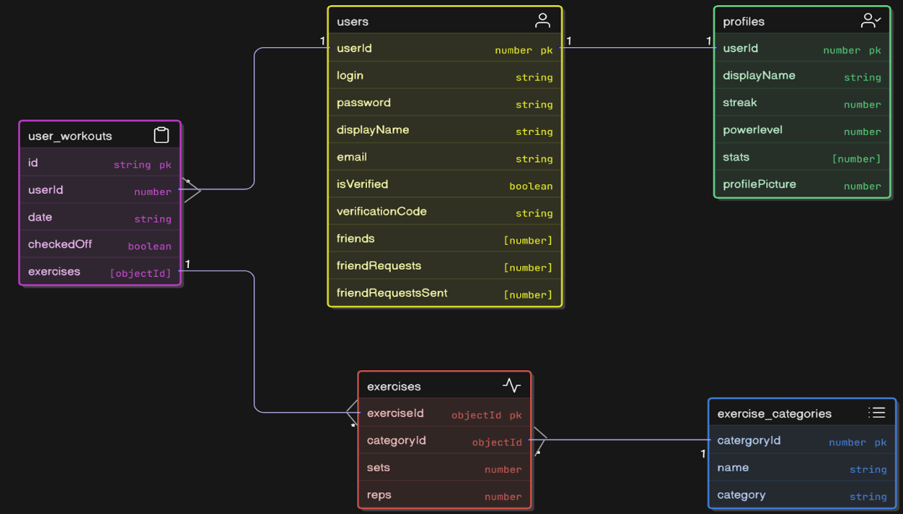
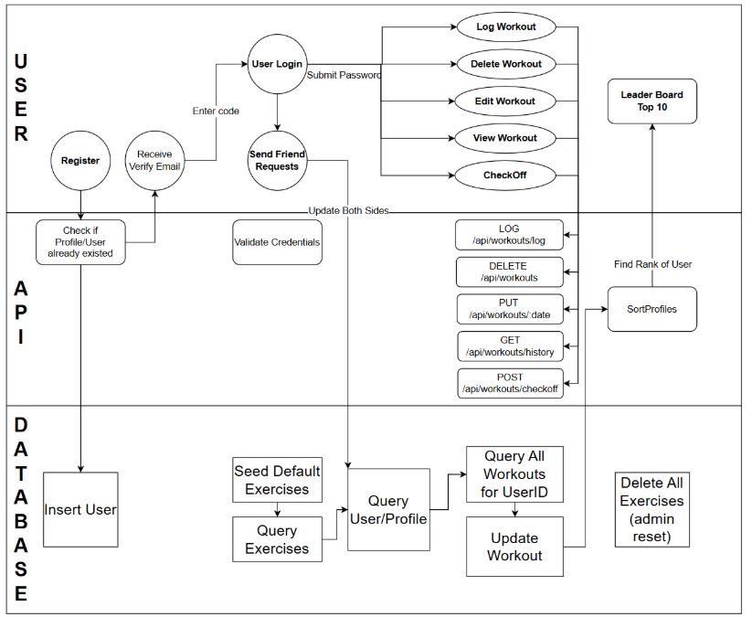

# PowerLeveling 🏋️‍♂️🔥

Level up your workouts — and your pride.  
PowerLeveling is a gamified fitness experience that turns exercise into adventure. Challenge your friends, conquer daily checkoffs, track your personal gains, and rise through the ranks of the leaderboard.

Visit our website to explore live demos and more.  
🌐 https://powerleveling.xyz/

---

## 📸 Preview

### Web Prototype

### App Prototype

---

## 🚀 Features

- **Workout Checkoff System**: Daily task-based exercise tracking to gamify your routine.
- **Leaderboard**: Compete globally or just with friends — see who’s the strongest!
- **Friend System**: Add, remove, and interact with friends across the app.
- **Profile Customization**: Upload a profile picture, view history, and manage progress.
- **Mobile-First Design**: Built with Expo and React Native to feel like a true app experience.
- **PowerLevel Logic**: Dynamic scoring system based on your training commitment.
- **Secure Login/Register**: Firebase-secured user authentication.
- **Real-Time Progress Updates**: Instantly sync checkoffs, changes, and stats.
- **Multi-Platform Support**: Web + mobile integration for ultimate flexibility.
- **Beautiful Anime-inspired UI**: Gamify your grind with vibrant, stylized design.

---

## 🧱 Tech Stack

### Frontend
- **Expo + React Native** (JavaScript/TypeScript)
- **Vite + React** for Web
- **Firebase Auth**
- **Axios** for API communication
- **Chakra UI** (planned for style consistency)

### Backend
- **Node.js + Express**
- **Modular API routes (RESTful)**
- **MongoDB Atlas**
- **OpenAI API (experimental AI Assistant integration)**
- **DigitalOcean VPS**
- **Postman & SwaggerHub** for testing and documentation

### Mobile
- **Expo + React Native**
- **Custom-built components**
- **Hooks, constants, and platform-specific tweaks**
- **Lightweight architecture suitable for iOS + Android**

---

## 🧩 Architecture Overview

The application follows a modular and scalable structure with several components:

📦 project-root/  
├── aiAssistant/ # Experimental AI interaction  
├── models/ # MongoDB schemas  
├── routes/ # REST API endpoints  
├── utils/ # Profile and power stat logic  
├── frontend/ # Web client (React + Vite)  
├── Mobile/ # Mobile app (Expo)  
├── server.js # Main server entry point  
├── api.js # External API gateway  
├── .github/workflows/ # GitHub Actions CI config  

yaml
Copy
Edit

All services communicate via REST APIs and share a common data schema. CI/CD is handled manually through Git and deployed to DigitalOcean.

---

## 🛡️ Security

- **Firebase Authentication**: Enforces secure user access
- **SSL/TLS** via Nginx proxy on DigitalOcean
- **Dotenv Configurations**: Sensitive environment variables are protected
- **User Control**: Users may delete accounts and associated data

---

## 📊 Diagrams

To better illustrate the application's design and flow, here are key diagrams used in planning:

### 🧩 Entity Relationship Diagram (ERD)

This diagram visualizes the relationships between key entities like Users, Workouts, Exercises, and Friendships.

### 🔄 Activity Diagram

This activity flow diagram shows how a typical user interacts with the daily workout checkoff system.

---

## 🧪 Testing

- **Postman** collections used to validate endpoints
- **SwaggerHub** used for live API documentation
- **Manual testing** on mobile and web platforms

---

## 🌐 Deployment

- **Backend**: DigitalOcean droplet with Node.js + Nginx
- **Frontend**: Deployed via Vercel (future)
- **Mobile**: Expo Go + TestFlight/Play Store (future)
- **GitHub Actions**: Planned CI/CD for backend updates

---

## 🔮 Upcoming Features

- **Voice Command Assistant**: Conversational workout coaching
- **Dynamic PowerLevel Formula**: Add time and difficulty weight
- **Mobile Push Notifications**: Check-in reminders and friend updates
- **Achievements and Badges**: Gamify long-term consistency
- **Progress Visualization**: Graph your gains over time

---

## 👥 Team Contributors

This project was originally built as a final group project for COP4331 at UCF.  
This personal refactor version isolates the architecture, logic, and components I contributed most to and have improved since the course ended.

🧠 Backend API: Thien Ha Le  
🏋️‍♂️ Workout Module: Chris Ferreira  
🎨 Frontend Design: Daniel Bakos, Jacob Pasche  
📱 Mobile Development: Jacob Thomas, Dennis Ngo  
🌐 Deployment & Infra: Harrison Mills

yaml
Copy
Edit

---

## 🤝 Want to Collaborate?

Feel free to fork this project or reach out for ideas, feedback, or feature requests!